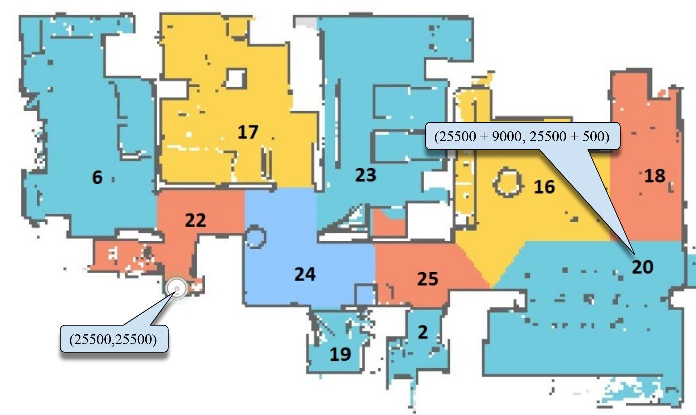

# Roborock S5 RPi remote controller
Welcome to an example of how you can use Python, python-miio, RPi, some electronics and woodworking to make a remote controller for Roborock S5 vacuum cleaner.

The material shown here is a snapshot of SW and HW that runs in my house so my whole family can use Roborock S5 without the smartphone app. The script is not that much generic so that you just snap in into your environment and run. Still, where it was not too demanding I have tried to stay as generic as possible. With these instructions you should be able to understand how it works and what you need to do to adapt it to your environment.

[This video](https://youtu.be/L5m7eMEBG1w) shows how simple it is to start a cleanup of two segments. It also shows the log output of the Python script. Having this remote controller doesn't affect functionality of an official MiHome application nor does it require modification of the vacuum itself. The output of the MiHome application is shown at the top left corner of the video.

## How it works
### An overview
The idea is rather simple: python-miio library allows you to get the status of and control the Roborock S5 vacuum cleaner via the python script. You can easily run the following actions (the python-miio library can do much more but these are the ones important for us):
 * start the cleaning of the rooms with given IDs
 * abort cleaning and go to the charger
 * go to a predefined place for the vacuum maintenance
 * (I have almost forgotten) triggering the famous "Hi, I'm over here!" sentence

Around that features list I have added a UI in the form of Raspberry Pi, push buttons and LEDs mounted on the wooden panel with room symbols so my kids can use it.
### User interface
The script controls cleaning of 11 zones. Front panel contains 11 (kids friendly) symbols for each zone. Each zone symbol holds one push button (connected to pull-resistor and RPi input line) and one LED (connected to RPi output line via limiting resistor). Besides that, the bottom section of the panel has 3 control buttons: start cleaning, abort and go home and go to the maintenance point. Together with them there is one signal LED which is used as a heartbeat indicator of the whole remote controller device.

This simple UI allows users to schedule multiple rooms cleaning: first select rooms that you want to clean and then press the 'start cleaning' button. During selection of the rooms (before you pressed the 'start cleaning' button) you can unschedule a particular room by pressing its button once more (gosh, I'd love elevators to have this feature - if you select the floor number by mistake you can deselect it but pressing that number again :) ).

Cleaning procedure can be paused/aborted by pressing the 'home button'.

In our case the vacuum charger (it's home) is hidden below the shoe closet so we cannot access it easily for maintenance reasons. Roboock S5 can be instructed to go to a predefined position for easy maintenance (e.g. near the trash bin) by pressing the 'maintenance button'.
### The script
Go to the `---- Main script ----` section in the [vacuum.py](vacuum.py) file and check the main blocks:

`ip,token = SystemInit()` extracts the Roborock's IP address and access token from the calling command line (TODO: add example of command line). Both parameters are needed for the communication with the vacuum. The way of getting them will be explained in [this](https://github.com/aleksandarzivkovic/roborock_remote/tree/doc_update#what-you-should-change-so-it-works-for-you) section. (TODO: replace absolute url with relative). A script logging mechanism is defined here. Logs will go to a standard output and to file `/tmp/vacuum.log`. Log file size is limited to a maximum of 1MB with keeping the last 5 log files. A `Ctrl+C` handler is defined here, which is handy during the debugging phase. 

`g_Vacuum = VacuumThread(ip, token, StatusChange)` loads `python-miio` library and runs the thread that initiates communication with the vacuum and checks its status (by pinging it every 5 seconds). Every time a thread detects the modified status a `StatusChange` callback will be triggered. This object contains methods for controlling the vacuum: `clean`,`find`,`home` and `maintenance`. `clean` method has one argument which is a list of segment IDs to be cleaned. For example, here is a map with segment IDs for our home:  `maintenance` actually executes goto command which sends vacuum to a predefined x,y position. When looking at the Android application map the position of the charger is the coordinate system start point (with coordinates 25500, 25500). In our case the maintenance position is 9m right and 0.5m up, therefore x,y positions are defined as:
```
self.m_x = 25500+9000
self.m_y = 25500+500
```

`ui = UIThread()` loads Python libraries for reading GPIO inputs and driving LEDs with PWM. This thread runs an empty loop while actions are executed with button press events and status change events.

Since this remote device has many buttons and LEDs the important point is the `g_gpioMap` map. This is a table where each row represents one GPIO line from RPi. For each GPIO line this table defines: line direction (button or LED), descriptive name (usable only for logging - here in Serbian), button press callback function, LED ID (that is used within UI mechanism) and room ID (that is used by the `python-miio` library). Any HW modification or change of the segment IDs needs to be reported here in order for a script to work properly.

### Where the script runs

#### Raspberry Pi OS
TODO script autostart
TODO lock the filesystem

#### Hardware
The electronic heart of this device is Raspberry Pi 3 A+ with inserted WiFi USB dongle and external 5V power supply. All connections to RPi (5V power, buttons, LEDs) are done via [the 40 pin IDC connector](https://www.digikey.com/en/products/detail/cnc-tech/3030-40-0102-00/3821472) and [the flat cable](https://www.digikey.com/en/products/detail/3m/3302-40-300SF/8256199). The case is made from a 4 mm plywood. The front panel is covered with laminated colour paper print. The device is intended to have a look&feel of an A4 photo frame hanging on the wall. 

Here is the back of the panel:

and here is the front:


Raspberry Pi A+ has 26 GPIO lines exposed. Four lines are taken for home, clean, maintenance buttons and heartbeat LED, leaving 22 GPIO lines for segments. Since each segment takes two lines, one for push button and one for LEDs the maximum number of segments supported by this script and HW is 11.

This figure shows how I have connected Raspberry Pi 3 A+ header to a 40 pin flat cable 

This table shows the GPIO lines and their usage in my configuration:
| GPIO ID  | Direction | Description (just room names in Serbian)|
| ---      | ---       | ---                        |
| 2        | Button    | Kupatilo                   |
| 3        | Button    | Vešernica                  |
| 4        | LED       | Kuhinja                    |
| 5        | LED       | Status                     |
| 6        | Button    | Održavanje                 |
| 7        | Button    | Stop                       |
| 8        | Button    | Dnevna soba - ispod prozora|
| 9        | Button    | Dnevna soba - tepih        |
|10        | LED       | Djordjeva soba             |
|11        | LED       | Dnevna soba - ispod prozora|
|12        | Button    | Hodnik - kod vešernice     |
|13        | LED       | Hodnik - kod vešernice     |
|14        | Button    | Kuhinja                    |
|15        | LED       | Kupatilo                   |
|16        | Button    | Hodnik - kod špajza        |
|17        | LED       | Vešernica                  |
|18        | Button    | Spavaća soba               |
|19        | LED       | Hodnik - kod špajza        |
|20        | LED       | Hodnik - kod ulaza         |
|21        | Button    | Start                      |
|22        | Button    | Isidorina soba             |
|23        | LED       | Isidorina soba             |
|24        | Button    | Djordjeva soba             |
|25        | LED       | Dnevna soba - tepih        |
|26        | Button    | Hodnik - kod ulaza         |
|27        | LED       | Spavaća soba               |

GPIO lines that are connected to push buttons already have pull-up resistors activated within a RPi. This gives input lines a logical '1' when inactive. When the button is pressed the line gets connected to GND giving logical '0'. GPIO lines that are connected to LEDs have a current limiting resistor of 330 Ohms.

## What you need to do so it works for you
1. Place a Raspberry Pi and the vacuum at the same WiFi network
2. Find a vacuum IP address and fix the IP address of the vacuum. This can be done by checking the list of DHCP clients on your home router and fixing a vacuum IP address based on its MAC address
3. Get the vacuum access token. I recommend the method described [here](https://github.com/PiotrMachowski/Xiaomi-cloud-tokens-extractor).
4. Find out the segment IDs. It is assumed that you have already defined segments for your home and with this step you need to identify the ID of each segment. Use [test.py](test.py) script to manually add numbers and check where your vacuum goes. Small hint here: during the test observe the Android map - when vacuum starts cleaning of the segment an app will mark that segment in its map so you don't need to wait for a vacuum to actually go there.
5. Here is your DIY part: print your own symbols for segments and make appropriate casing with buttons and LEDs. Can I use the common sentence from web sites about cooking here: please post pictures of your results! :)
6. Wire the buttons and the LEDs and update the `g_gpioMap` map. Please note that the maximum number of segments that you can address with RPi 3 A+ is 11. If you want more than that, consider implementation of SPI/I2C GPIO extender and changing the script. Small hint: order of GPIO lines is not important (as long as you don't mix them with GND, power and other pins on RPi header connector), always first do the wiring and then update the map (rather than vice versa) - SW update is easier than HW update.
7. Setup a RPi OS so the script is always started at power-up and lock the file system for writing to prevent SD card wearout. The details are described [here](https://github.com/aleksandarzivkovic/roborock_remote/blob/doc_update/README.md#raspberry-pi-os) TODO: update link from branch to master

